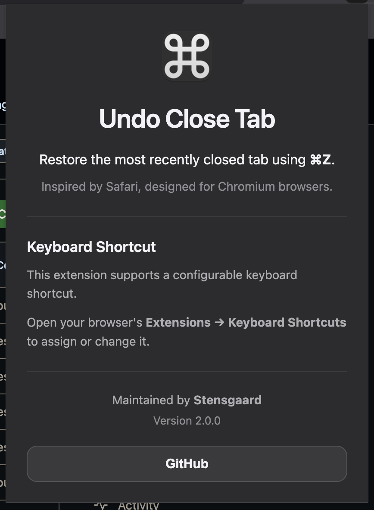
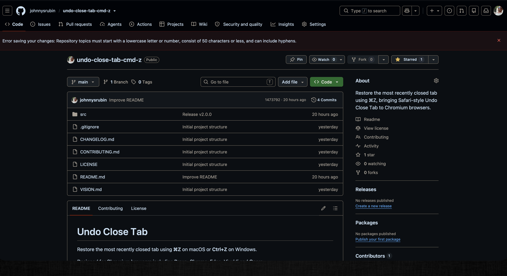
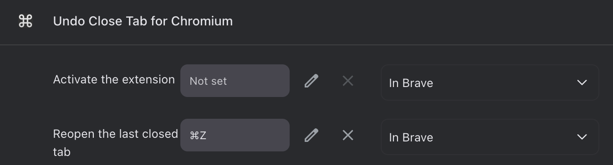

  

<h1 align="center">Undo Close Tab</h1>

Restore the most recently closed tab using a configurable keyboard shortcut.
 
Designed for Chromium browsers.

---

## Features

- Restore the most recently closed tab with a configurable keyboard shortcut
- Designed for Chromium browsers
- Compatible with Brave, Google Chrome, Microsoft Edge, Vivaldi and Opera
- Does not interfere with Undo while typing in text fields
- Lightweight and fast
- No tracking
- No analytics
- No data collection

---

## Screenshots

### Extension Popup

### Toolbar

### Keyboard Shortcut Settings

---

## Supported Browsers

| Browser | Supported |
|----------|:---------:|
| Brave | ✅ |
| Google Chrome | ✅ |
| Microsoft Edge | ✅ |
| Vivaldi | ✅ |
| Opera | ✅ |

---

## Installation

1. Download or clone this repository.
2. Open your browser's extensions page:

- Brave: `brave://extensions`
- Chrome: `chrome://extensions`
- Edge: `edge://extensions`

3. Enable **Developer mode**.
4. Click **Load unpacked**.
5. Select the **src** folder.

---

## Keyboard Shortcut

Undo Close Tab supports a configurable keyboard shortcut.

Open your browser's:

**Extensions → Keyboard Shortcuts**

and assign your preferred shortcut.

Suggested shortcuts:

- **macOS:** ⌘Z
- **Windows / Linux:** Ctrl+Z

> Browser shortcuts cannot be assigned automatically. They must be configured once by the user.

---

## Permissions

Undo Close Tab requires only one permission:

| Permission | Purpose |
|------------|---------|
| `sessions` | Restore the most recently closed tab |

No additional permissions are required.

---

## Privacy

Undo Close Tab:

- Does not collect personal information
- Does not track users
- Does not connect to external servers
- Does not require an account
- Does not display advertisements

Everything runs locally inside your browser.

---

## Acknowledgements

This project was inspired by the original **Reopen Closed Tab with Command + Z / Ctrl + Z** extension by **Yunfang Hou**.

It has since been redesigned and modernised with:

- A simplified codebase
- A modern Apple-inspired interface
- New branding
- Improved documentation
- Manifest V3
- Configurable keyboard shortcuts

---

## License

This project is licensed under the MIT License.

See the **LICENSE** file for details.

---

Created and maintained by <strong>Stensgaard</strong>

